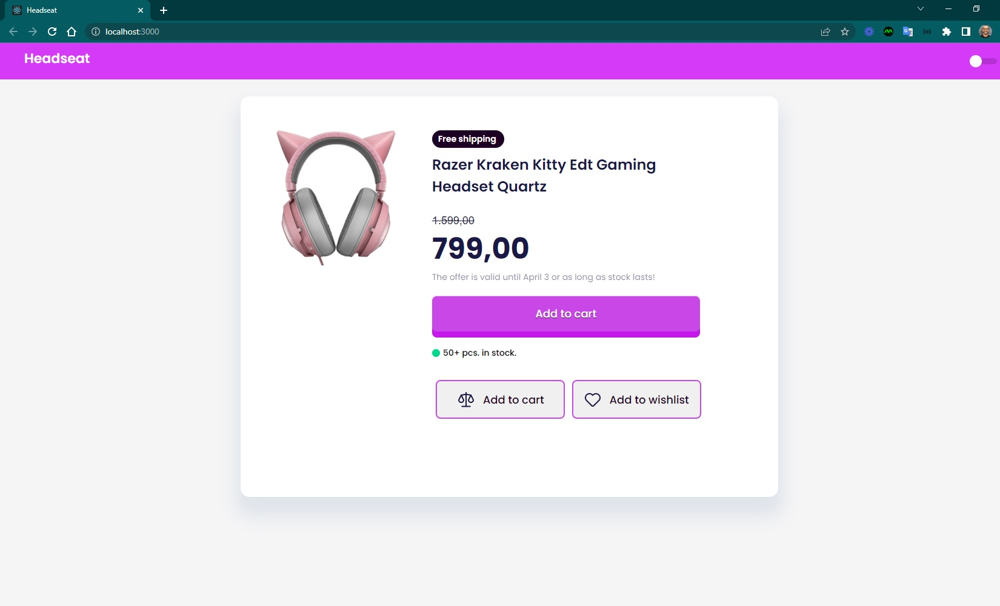
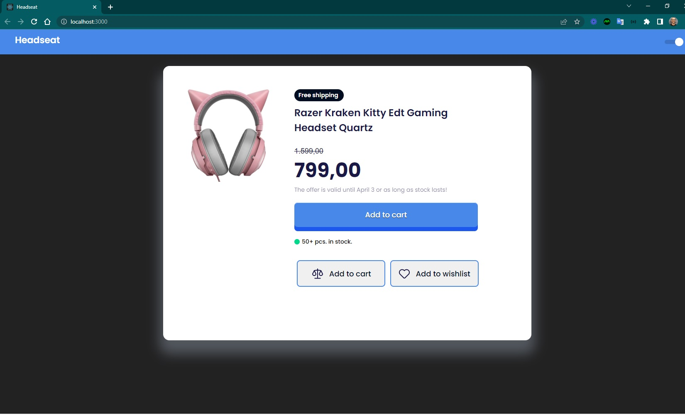

<h4 align="center"> 
	🚧 Headset 🚀
</h4>

  

   

### Layout

Projeto frontend para ser pixel perfect com design do [Figma](https://www.figma.com/file/19O5HFND66vzRlnpBUhWxB/day_1575?node-id=1%3A2&t=sxI085QLRtlRNj0T-0). 

#### Tecnologias

- reactjs
- typescript 
- styled-component

#### Tarefas

- [x] desenhar os elementos
- [x] posicionar os elementos
- [x] font texto free, texto razer, priceoff, priceon, offer, botão azul, stock, dois botões
- [x] ButtonPrimary: efeito do botão como botão físico de jogo
- [x] separar em ButtonGroup e ButtonSecondary
- [x] ButtonSecondary: um botão que aceite prop com icone e label: children
- [x] Image: que aceite prop com a url da imagem 
- [x] aperfeiçoar o styled-components com props dos styles 
- [ ] warnings
- [ ] responsividade

### Telas

  
   

### Inspirações

Desenhar um modelo de loja virtual de aplicações

- [Código de Loja Virtual](https://github.com/LeonardoCamargo31/loja-virtual) 
- [Design de Loja Virtual](https://morioh.com/p/09ec4bc619bf)  
- [Layout E-commerce em ReactJS](https://reactjsexample.com/create-an-e-commerce-site-with-react-js/amp/)  
- [Layout de Loja Virtual](https://www.luiztools.com.br/obrigado/)  
- [E-commerce](https://joaogsdc.medium.com/react-criando-ecommerce-marketplace-1-parte-d318bcd0f4c8)   
- [E-commerce](https://github.com/martins-rafael/launchstore#instala%C3%A7%C3%A3o-e-uso)   
- [Loja Online](https://www.alura.com.br/curso-online-loja-online-shopify)   
- [E-commerce](https://hotmart.com/pt-br/marketplace/produtos/criando-um-ecommerce-do-zero-com-nodejs-react-e-mongodb/W10551234Y)  
