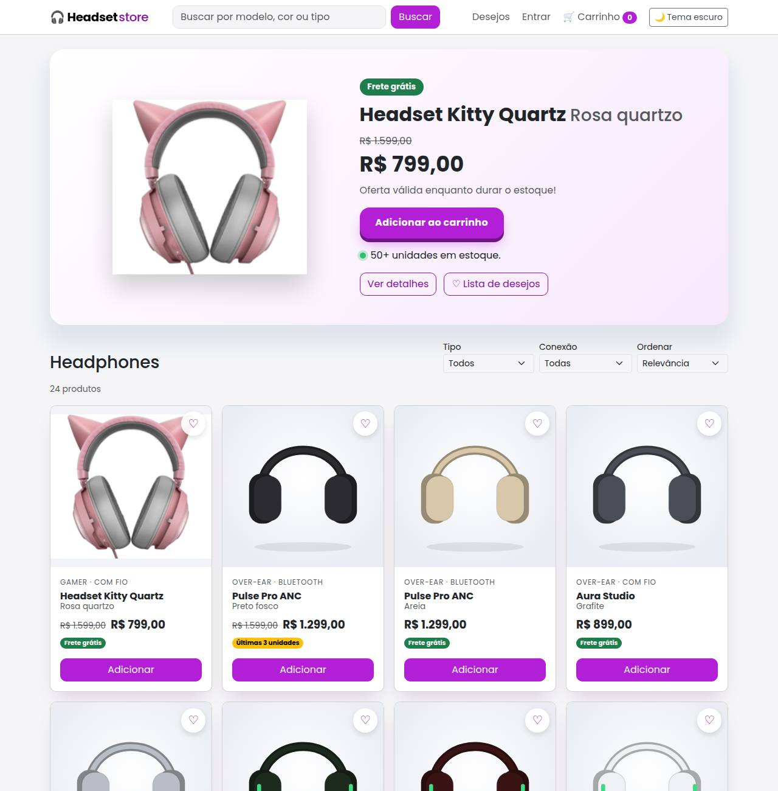
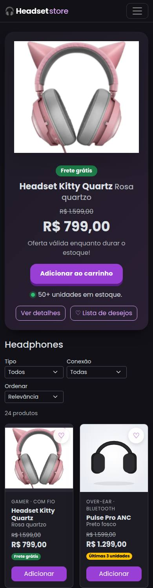
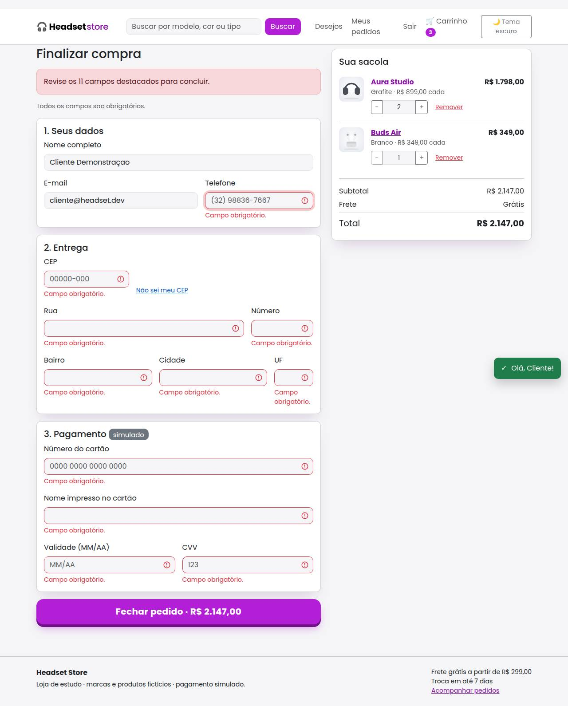
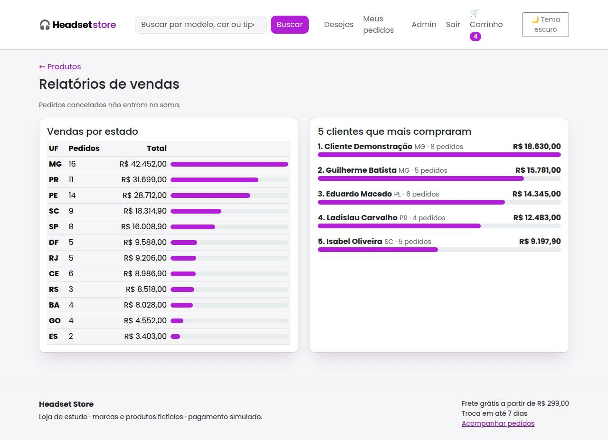

<h1 align="center">🎧 Headset Store</h1>

<p align="center">E-commerce de headphones fullstack em TypeScript · React + Vite + Bootstrap/LESS · Express + Drizzle ORM + SQLite</p>

<p align="center">
  
  
</p>

## Sobre

Loja de fones de ouvido construída a partir do teste técnico **Full Stack** (originalmente Laravel + Vue.js, loja de camisetas), adaptado para headphones e para uma stack 100% TypeScript. O card de destaque da vitrine é o layout original deste repositório (frete grátis, preço de/por, botão "físico" de jogo, estoque e ações), agora ligado a dados reais.

**Funcionalidades**
- Catálogo com busca, filtros por tipo e conexão, ordenação e paginação na URL.
- Página de produto, **carrinho** persistente (cotado no servidor) e **lista de desejos**.
- Cadastro e login com sessão em cookie `httpOnly`.
- **Checkout** (exercício 12) com validação de todos os campos, CEP automático via `cep-promise`, indicadores de carregamento, mensagem de sucesso e `console.log` do objeto final.
- Pedido criado em **transação** com baixa de estoque; e-mail de confirmação por **fila**.
- **Histórico de compras** com detalhe e "Comprar de novo".
- **Admin**: CRUD de produtos com upload de imagem (exercício 10) e relatórios de vendas (exercício 14).
- Tema claro/escuro, acessibilidade AA verificada com axe-core, rotas carregadas sob demanda.

## Como rodar

Requisitos: **Node.js 20+** (testado no 22) e npm.

```bash
git clone https://github.com/douglasabnovato/headset.git
cd headset
npm install
npm run dev
```

- Loja: http://localhost:5173 · API: http://localhost:3333/api/health
- O banco SQLite é criado em `server/data/headset.db` e populado automaticamente na primeira execução.

| Conta de demonstração | E-mail | Senha |
|---|---|---|
| Cliente | cliente@headset.dev | Cliente@123 |
| Admin | admin@headset.dev | Admin@123 |

Cartão de teste: `4111 1111 1111 1111`, validade futura (ex.: `12/30`), CVV `123`.

| Script | O que faz |
|---|---|
| `npm run dev` | API (tsx watch) + front (Vite) juntos |
| `npm test` | testes do front (Vitest) e da API (Vitest + Supertest, banco em memória) |
| `npm run build` | checagem de tipos + build de produção em `dist/` |
| `npm run db:seed` | apaga e recria os dados de exemplo (rode com a API parada, para não servir cache antigo) |
| `npm run typecheck` | tipos do front e da API |

Variáveis opcionais em `server/.env` (veja `.env.example`). Em produção, `JWT_SECRET` é obrigatório.

## Em produção

**Demonstração:** https://headset-store.onrender.com

- Um único serviço gratuito no Render entrega a API e o front na mesma origem (o cookie de sessão continua `httpOnly` + `SameSite=Lax`, sem CORS).
- Configuração em `render.yaml`: build com `npm ci --include=dev && npm run build`, início com `npm run start:prod`, health check em `/api/health`.
- `DEMO=1` desliga o upload de imagens no admin (as contas de demonstração são públicas).
- Limitações do plano gratuito: o serviço dorme após 15 minutos sem acesso e leva cerca de 1 minuto para acordar; o disco é temporário, então o banco volta aos dados de exemplo a cada reinício.
- CI no GitHub Actions: tipos, testes e build a cada push na `main`.
- Passo a passo completo: [docs/DEPLOY.md](docs/DEPLOY.md).

## Exercícios do teste

| Nº | Tema | Onde |
|---|---|---|
| 1 | Ciclo de vida de componentes | [docs/exercicios/01-ciclo-de-vida.md](docs/exercicios/01-ciclo-de-vida.md) |
| 2 | Autenticação front ↔ back | implementado · [02-autenticacao.md](docs/exercicios/02-autenticacao.md) |
| 3 | Endpoint lento | [03-endpoint-lento.md](docs/exercicios/03-endpoint-lento.md) |
| 4 | CDN | [04-cdn.md](docs/exercicios/04-cdn.md) |
| 5 | Memcached / ElastiCache | implementado (`server/src/lib/cache.ts`) · [05-cache.md](docs/exercicios/05-cache.md) |
| 6 | ORM e N+1 | [06-orm-n-mais-1.md](docs/exercicios/06-orm-n-mais-1.md) |
| 7 | Filas assíncronas | implementado (`server/src/lib/queue.ts`) · [07-filas.md](docs/exercicios/07-filas.md) |
| 8 | Transactions | implementado (`POST /api/orders`) · [08-transactions.md](docs/exercicios/08-transactions.md) |
| 9 | Leitura de log | [09-log.md](docs/exercicios/09-log.md) |
| 10 | CRUD com autenticação | `/admin/produtos` + `server/src/routes/products.ts` |
| 11 | Crítica de código | [11-critica-transformer.md](docs/exercicios/11-critica-transformer.md) |
| 12 | Página de finalização de compra | `/checkout` · `src/pages/Checkout.tsx` |
| 13 | Experiência profissional | [13-experiencia.md](docs/exercicios/13-experiencia.md) (roteiro) |
| 14 | SQL de vendas | [docs/sql/14-vendas.sql](docs/sql/14-vendas.sql) + `/admin/relatorios` |
| 15 | SQL de estoque | [docs/sql/15-estoque.sql](docs/sql/15-estoque.sql) |

Especificação completa (requisitos, modelo de dados, rotas e telas): [docs/ESPECIFICACAO.md](docs/ESPECIFICACAO.md).

## Decisões técnicas

| Decisão | Por quê |
|---|---|
| TypeScript no front e na API | tipos compartilhados de ponta a ponta e erros pegos no build |
| React + Vite (no lugar de Vue) | continuidade com o código existente do repositório; Vite dá dev server rápido e *code splitting* |
| Express + **Drizzle ORM** + **SQLite** | roda com `npm install`, sem Docker nem download de binários; Drizzle gera tipos do schema e SQL legível. Trocar para MySQL/Postgres = trocar o driver |
| Sessão em cookie `httpOnly` (JWT) | token fora do alcance de scripts (XSS); `SameSite=Lax` contra CSRF — mesmo desenho do Laravel Sanctum para SPA |
| Preço sempre calculado no servidor | o carrinho no navegador é só um retrato; a API recota e grava o preço vigente |
| Valores em centavos inteiros | sem erro de arredondamento de ponto flutuante |
| Snapshot de nome e preço no item do pedido | histórico não muda quando o produto é editado ou removido |
| Produto vendido é inativado, não excluído | preserva a integridade do histórico |
| Bootstrap 5.3 + **LESS** | componentes prontos e acessíveis; o LESS personaliza tokens (cores, fonte Poppins, raios), temas claro/escuro, o botão "físico" do layout original e ajustes de contraste AA (`src/styles/main.less`, `tokens.less`) |
| `@faker-js/faker` só no seed | clientes e pedidos de exemplo para histórico e relatórios; o catálogo é curado à mão para ter nomes e especificações coerentes |
| Imagens SVG locais | ilustrações leves, sem depender de sites de terceiros; o upload aceita PNG/JPG/WebP até 2 MB |
| `cep-promise` com fallback | se o serviço de CEP falhar, os campos continuam editáveis e a pessoa é avisada |

## Qualidade

- **Testes da API** (10): cadastro e login, cookie `httpOnly`, 401/403 por papel, CRUD e validações, upload inválido, cache, cotação com preço do servidor, pedido com baixa de estoque, *rollback* quando falta estoque, isolamento do histórico por cliente, relatórios.
- **Testes do front** (4): Luhn, validade, máscaras e obrigatoriedade de todos os campos do checkout.
- **Acessibilidade**: axe-core (WCAG 2 A/AA) sem violações nas 8 telas principais, nos dois temas; foco visível, "pular para o conteúdo", `aria-live` para avisos e erros, `aria-invalid` + `aria-describedby` nos campos.
- **Performance**: rotas *lazy* (o checkout é um chunk próprio), imagens com dimensões e `loading="lazy"`, cache de listagem com invalidação, `ETag` com `Cache-Control: no-cache`, índices no banco, log de requisições acima de 300 ms.

## Estrutura

```
headset/
├── index.html · vite.config.ts        front (Vite)
├── src/
│   ├── api/ context/ hooks/ lib/       cliente HTTP, sessão, carrinho, validações
│   ├── components/ pages/ pages/admin/
│   └── styles/                         main.less + tokens.less
├── static/                             favicon e imagens dos produtos
├── server/
│   ├── src/ (app, routes, middleware, lib, db, transformers)
│   ├── drizzle/                        migração SQL
│   └── tests/
└── docs/                               especificação, exercícios e SQL
```

<p align="center"> </p>

---
Projeto de estudo · marcas, produtos e pagamentos fictícios · por [@douglasabnovato](https://github.com/douglasabnovato)
